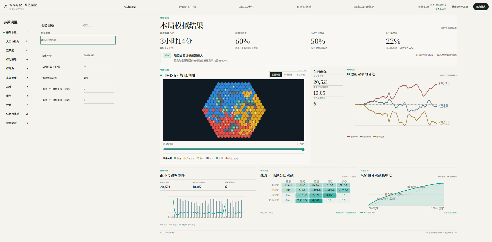
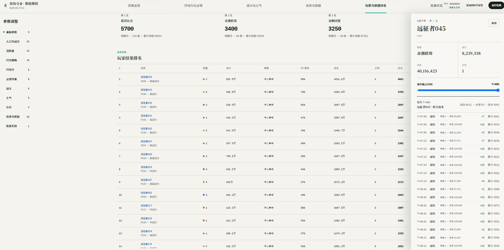

# Island Gold Rush Numerical Simulator

[Open the live simulator](https://zlllllll395487.github.io/Island-Gold-Rush-Numerical-simulator/)

### 仿真总览



### 玩家排名与积分流水



一个可交互、可重复运行的网页数值模拟器，用于观察多人联盟玩法中，行动力、占领时长、战力分布、活跃度、士气、任务奖励与积分规则之间的联动影响。

## 玩法概述

三支实力相近的联盟在六边形海岛地图上扩张。玩家消耗行动力出征，通过相邻地格推进、资源争夺和战斗队列逐步接触其他联盟。占领时长会随推进距离变化，玩家的战力、活跃度、士气和行为策略共同影响战局节奏。

## 主要功能

- 生成 300 名虚拟玩家与 3 个实力相近的联盟
- 模拟分层战力、活跃度、行动力和多编队配置
- 支持中心冲锋、支援扩张、多线作战等行为策略
- 模拟行动力恢复、占领时长、战斗队列、士气与中心驻防
- 计算任务、奖励、战功、个人排名和联盟排名
- 提供地图回放、趋势图、统计摘要与批量实验
- 在左侧参数面板修改数值，并重新运行完整模拟

## 本地运行

需要 Node.js 22.13 或更高版本。

```bash
npm install
npm run dev
```

浏览器打开终端提示的本地地址即可使用全部功能。

## 验证

```bash
npm test -- --maxWorkers=1 --testTimeout=15000
npm run lint
npm run build
```

## 目录结构

- `app/`：页面入口与站点元数据
- `src/domain/`：配置类型、默认值与校验
- `src/population/`：玩家生成、联盟匹配与策略分配
- `src/simulation/`：地图推进、战斗、士气与行动力仿真
- `src/analytics/`：指标与批量实验汇总
- `src/components/`：参数面板、地图、图表和排名界面
- `tests/`：配置、仿真、分析与界面回归测试

## 数据与隐私

本仓库仅包含独立的通用模拟逻辑、示例地图和自动化测试，不包含真实玩家数据、线上配置、内部策划文档、部署凭证或其他项目代码。提交历史保留了模拟器主要功能的迭代过程。

## GitHub Pages

The public site is built from pages/ and deployed automatically from main by .github/workflows/deploy-pages.yml.

Build and verify locally with:

    npm run build:pages
    npm run verify:pages
